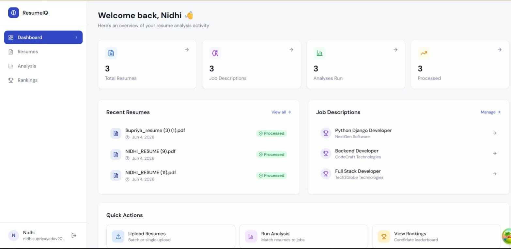
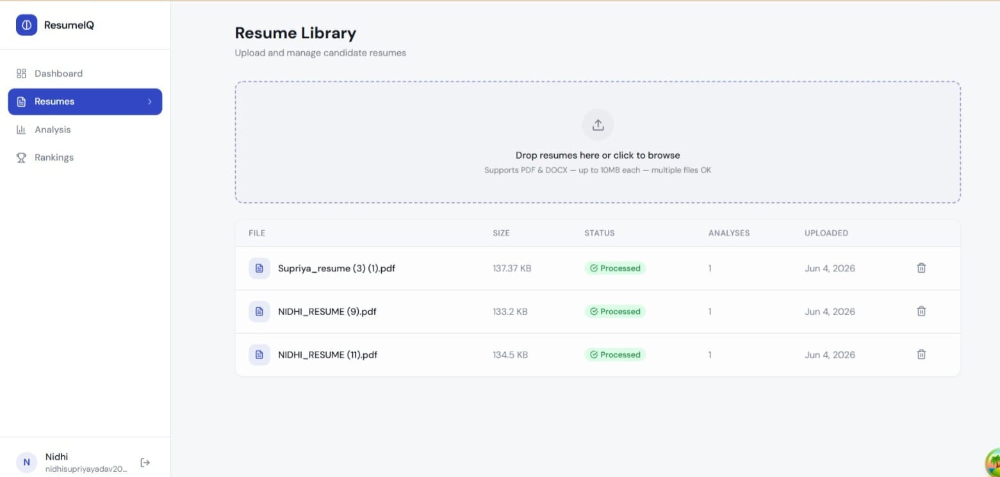
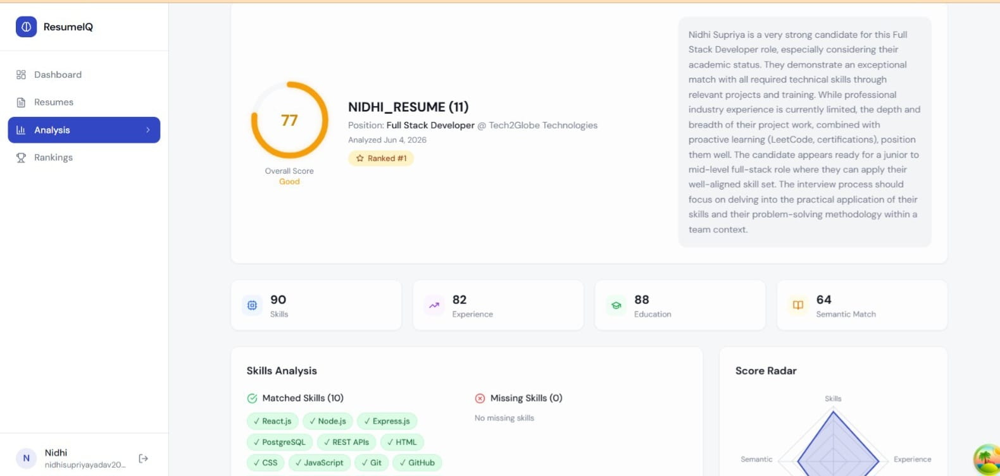
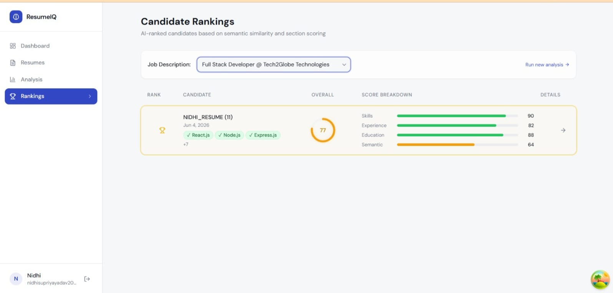

# ResumeIQ — AI Resume Analyzer

> A production-grade, full-stack AI-powered ATS (Applicant Tracking System) that uses Google Gemini 2.0 Flash and semantic embeddings to intelligently analyze, score, and rank candidate resumes against job descriptions.


---

## Architecture

```
ai-resume-analyzer/
├── apps/
│   ├── backend/                    # Express + TypeScript API
│   │   ├── src/
│   │   │   ├── config/            # DB, Redis, Gemini AI
│   │   │   ├── controllers/       # Route handlers
│   │   │   ├── middleware/        # Auth, validation, error, upload
│   │   │   ├── repositories/      # Prisma data layer
│   │   │   ├── routes/            # Express router
│   │   │   ├── services/          # Business logic
│   │   │   ├── utils/             # Logger, API response, errors
│   │   │   └── validators/        # Zod schemas
│   │   ├── prisma/
│   │   │   ├── schema.prisma      # Full DB schema with pgvector
│   │   │   └── seed.ts
│   │   └── Dockerfile
│   └── frontend/                   # React + Vite + TailwindCSS
│       ├── src/
│       │   ├── components/        # UI components
│       │   ├── lib/               # API client, utilities
│       │   ├── pages/             # Route pages
│       │   └── store/             # Zustand state
│       └── Dockerfile
├── packages/
│   ├── types/                      # Shared TypeScript types
│   └── utils/                      # Shared utility functions
├── docker-compose.yml
└── README.md
```

---

## AI Pipeline

```
Upload PDF/DOCX
      ↓
Extract Raw Text (pdf-parse / mammoth)
      ↓
LLM Structured Parsing (Gemini 2.0 Flash)
 → name, email, phone, skills, experience, education, projects
      ↓
Generate Embeddings (text-embedding-004, 768-dim)
      ↓
Store Embeddings in pgvector
      ↓
Compare Resume ↔ JD via Cosine Similarity
      ↓
Section-wise Scoring (AI-judged: skills, experience, education)
      ↓
Weighted Overall Score (60% AI + 40% Semantic)
      ↓
Generate Feedback (strengths, weaknesses, suggestions, interview notes)
      ↓
Rank All Candidates → Leaderboard
```

---

## Features

### Core
- ✅ PDF & DOCX resume upload (single + batch)
- ✅ AI-powered text extraction and structured parsing
- ✅ Resume sections: contact, skills, experience, education, projects

### Advanced
- ✅ **Embedding-based semantic matching** — not keyword matching
- ✅ **Section-wise scoring** — skills / experience / education / semantic
- ✅ **Resume ranking leaderboard** per job description
- ✅ **AI feedback** — strengths, weaknesses, suggestions, interview notes
- ✅ **Parallel processing** — multiple resumes analyzed concurrently
- ✅ **JWT authentication** with bcrypt password hashing
- ✅ **Winston logging** — `logs/error.log` + `logs/combined.log`
- ✅ **Redis caching** — analysis + rankings cached
- ✅ **Pagination** on all list endpoints
- ✅ **Zod validation** on all inputs
- ✅ **Global error middleware** with centralized responses

---

## Tech Stack

| Layer | Technology |
|-------|-----------|
| Backend | Node.js 20, Express, TypeScript |
| ORM | Prisma 5 with pgvector extension |
| Database | PostgreSQL 16 |
| Cache | Redis 7 |
| AI | Google Gemini 2.0 Flash + text-embedding-004 |
| Auth | JWT + bcryptjs |
| Validation | Zod |
| Logging | Winston |
| Upload | Multer |
| Frontend | React 18, Vite 5, TailwindCSS |
| State | TanStack Query v5, Zustand |
| Forms | React Hook Form + Zod |
| Charts | Recharts |
| Containers | Docker + Docker Compose |

---

## Setup Instructions

### Prerequisites
- Node.js 20+
- Docker & Docker Compose
- Google Gemini API key ([get one free](https://aistudio.google.com/app/apikey))

### 1. Clone & Install

```bash
git clone <repo-url>
cd ai-resume-analyzer
cp .env.example .env
# Edit .env and add your GEMINI_API_KEY
npm install
```

### 2. Start Infrastructure

```bash
# Start PostgreSQL + Redis
docker-compose up postgres redis -d
```

### 3. Database Setup

```bash
cd apps/backend
cp .env.example .env
# Edit .env with your settings

# Run migrations
npm run db:migrate

# Seed demo data
npm run db:seed
```

### 4. Run Development Servers

```bash
# From root — runs both backend and frontend
npm run dev
```

Or separately:
```bash
npm run dev:backend   # http://localhost:4000
npm run dev:frontend  # http://localhost:3000
```

---

## Docker (Full Stack)

```bash
# Build and start everything
cp .env.example .env
# Edit .env with GEMINI_API_KEY

docker-compose up --build

# Frontend: http://localhost:3000
# Backend:  http://localhost:4000
# API:      http://localhost:4000/api
```

---

## Environment Variables

| Variable | Description | Default |
|----------|-------------|---------|
| `DATABASE_URL` | PostgreSQL connection string | required |
| `REDIS_URL` | Redis connection string | `redis://localhost:6379` |
| `JWT_SECRET` | JWT signing secret | required |
| `GEMINI_API_KEY` | Google Gemini API key | required |
| `PORT` | Backend server port | `4000` |
| `UPLOAD_DIR` | File upload directory | `uploads` |
| `MAX_FILE_SIZE` | Max upload size in bytes | `10485760` (10MB) |
| `BCRYPT_ROUNDS` | Password hash rounds | `12` |
| `CORS_ORIGIN` | Allowed CORS origin | `http://localhost:3000` |

---

## API Reference

### Authentication
| Method | Endpoint | Description |
|--------|----------|-------------|
| POST | `/api/auth/register` | Register new user |
| POST | `/api/auth/login` | Login, returns JWT |
| GET | `/api/auth/me` | Get current user profile |

### Resumes
| Method | Endpoint | Description |
|--------|----------|-------------|
| POST | `/api/resume/upload` | Upload single resume |
| POST | `/api/resume/upload-multiple` | Upload multiple resumes (parallel) |
| GET | `/api/resume` | List resumes (paginated) |
| GET | `/api/resume/:id` | Get resume with sections + analyses |
| DELETE | `/api/resume/:id` | Delete resume |

### Analysis
| Method | Endpoint | Description |
|--------|----------|-------------|
| POST | `/api/analysis/job-descriptions` | Create job description |
| GET | `/api/analysis/job-descriptions` | List job descriptions |
| POST | `/api/analysis/run` | Run analysis (batch) |
| GET | `/api/analysis/:id` | Get full analysis result |
| GET | `/api/analysis/rankings?jobDescriptionId=` | Get ranked leaderboard |
| GET | `/api/analysis/by-jd?jobDescriptionId=` | Get analyses for a JD |

---

## Sample Inputs

### Register
```json
{
  "name": "Jane Smith",
  "email": "jane@company.com",
  "password": "Secure@123"
}
```

### Create Job Description
```json
{
  "title": "Senior Full Stack Engineer",
  "company": "Acme Corp",
  "description": "We need a senior engineer with 5+ years experience in React, Node.js, PostgreSQL...",
  "skills": ["React", "TypeScript", "Node.js", "PostgreSQL", "Docker"]
}
```

### Run Analysis
```json
{
  "resumeIds": ["uuid-1", "uuid-2", "uuid-3"],
  "jobDescriptionId": "jd-uuid"
}
```

---

## Sample Output

### Analysis Result
```json
{
  "overallScore": 87,
  "skillsScore": 92,
  "experienceScore": 84,
  "educationScore": 88,
  "semanticScore": 79,
  "matchedSkills": ["React", "TypeScript", "Node.js", "PostgreSQL"],
  "missingSkills": ["Kubernetes", "GraphQL"],
  "strengths": [
    "Strong TypeScript and React expertise with 6 years of hands-on experience",
    "Proven track record building scalable Node.js microservices"
  ],
  "weaknesses": [
    "Limited cloud infrastructure experience (AWS/GCP)",
    "No mentions of GraphQL in resume"
  ],
  "suggestions": [
    "Add AWS certifications or cloud projects to strengthen infrastructure profile",
    "Include GraphQL experience or side projects using it",
    "Quantify achievements with metrics (e.g., reduced load time by 40%)"
  ],
  "interviewNotes": [
    "Ask about largest scale system they've designed",
    "Probe depth of TypeScript type system knowledge",
    "Discuss CI/CD pipeline experience"
  ]
}
```

---

## Database Schema

Key entities and relationships:

```
User ──< Resume ──< ResumeSection
User ──< JobDescription
User ──< Analysis
Resume ──< Analysis >── JobDescription
Resume ──< ResumeEmbedding (pgvector)
JobDescription ──< JobDescriptionEmbedding (pgvector)
```

---

## Assumptions

1. **Gemini API** — Uses `gemini-2.0-flash` for text tasks and `text-embedding-004` (768 dims) for embeddings
2. **Async Processing** — Resume parsing happens asynchronously after upload; poll status
3. **Single tenant** — Each user manages their own resumes and job descriptions
4. **File storage** — Files are stored locally; swap `filePath` for S3 in production
5. **Embeddings** — Only one embedding per resume (full text); section embeddings can be added

## Limitations

1. **No real-time updates** — Frontend polls every 3s for processing status; WebSockets would be cleaner
2. **Local file storage** — No S3/GCS integration (easy to add)
3. **No email verification** — Register immediately grants access
4. **No multi-tenancy / team features** — Single user scope
5. **Rate limits** — Gemini API has per-minute limits; large batches may hit them

## Future Improvements

- [ ] WebSocket-based real-time processing updates
- [ ] S3/GCS file storage backend
- [ ] Email notifications when analysis completes
- [ ] CV improvement AI chat assistant
- [ ] ATS export (CSV, Excel)
- [ ] Team collaboration and sharing
- [ ] Custom scoring weight configuration
- [ ] Interview scheduling integration
- [ ] Resume anonymization for blind screening
- [ ] Multi-language support

---

## Demo Credentials (after seeding)

```
Email:    demo@resumeiq.com
Password: Demo@1234
```

---

*Built with ❤️ using Node.js, React, Prisma, pgvector, and Google Gemini AI*
<<<<<<< HEAD
<<<<<<< HEAD
=======


## Screenshots

### Dashboard


### Resume Library


### Analysis Result


### Candidate Rankings

<<<<<<< HEAD
=======

=======

